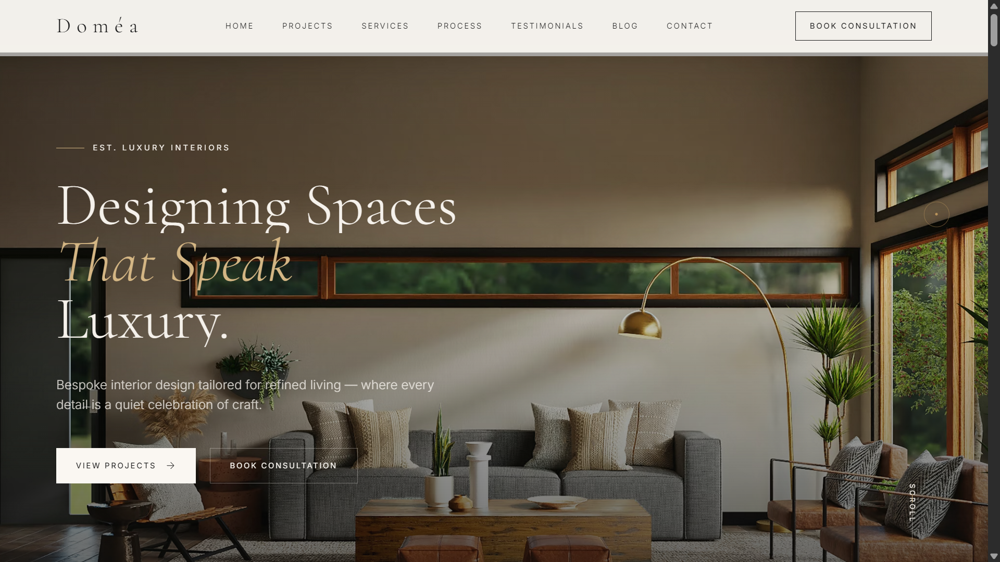
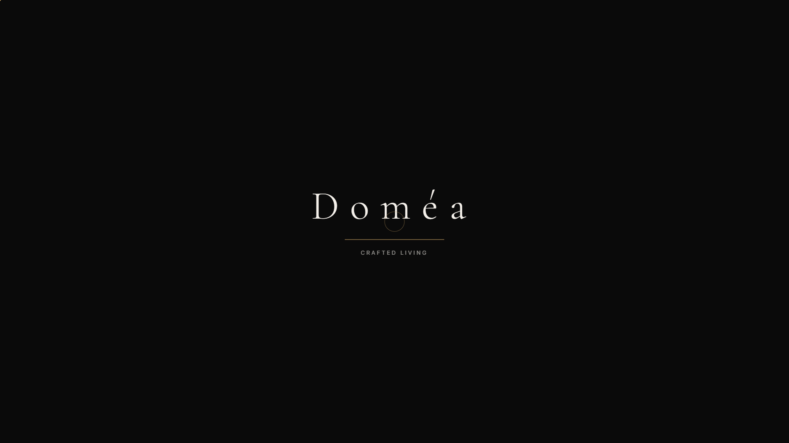
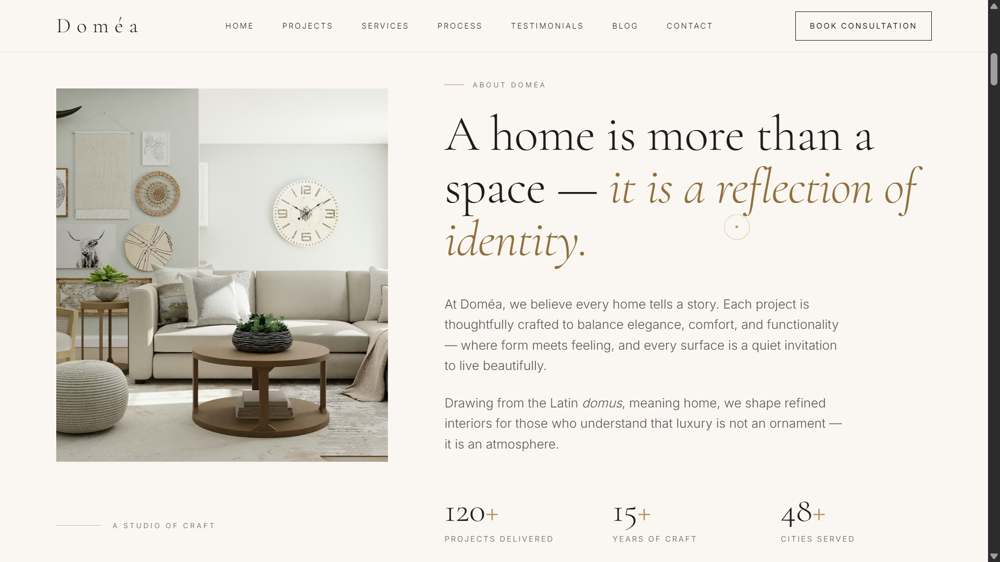
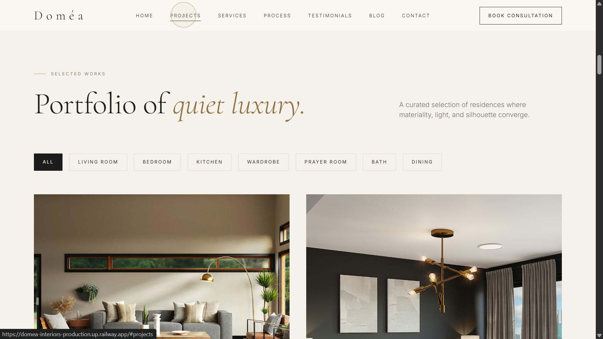
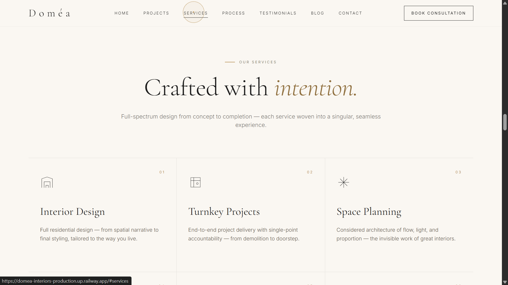
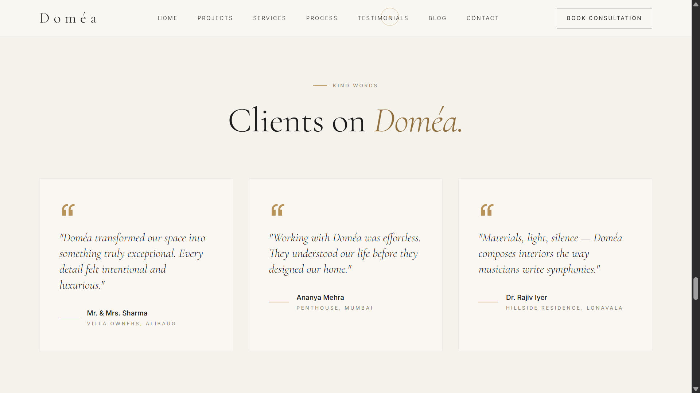
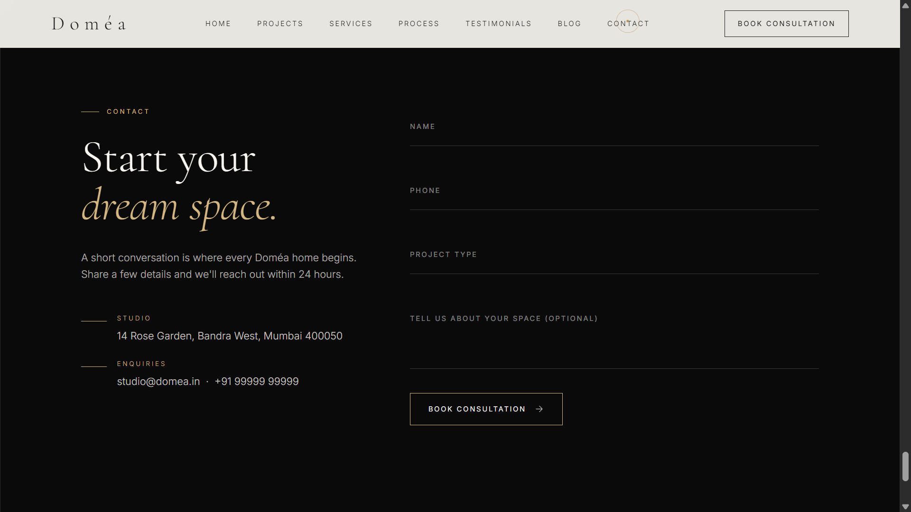

<div align="center">



<br />

# Doméa

### *Designing Spaces That Speak Luxury.*

A fully responsive, single-page website for **Doméa** — a luxury interior design studio crafting timeless, elegant, and high-end residential interiors.
Built with refined typography, generous whitespace, and premium-feeling motion.

<br />

[](https://developer.mozilla.org/docs/Web/HTML)
[](https://tailwindcss.com)
[](https://greensock.com/gsap/)
[](https://developer.mozilla.org/docs/Web/JavaScript)
[](https://lenis.studiofreight.com/)
[](#license)

<br />

### [✦ View Live Demo ✦](https://domea-interiors-production.up.railway.app/)

> *If this project inspired you, consider leaving a* ⭐ — *it really helps.*

</div>

---

## ✦ Highlights

- 🎬 **Cinematic hero** — fullscreen imagery with staggered text reveal
- 🖱️ **Custom gold cursor** — dot + ring with hover states on every interactive element
- 🪶 **Lenis smooth scroll** — buttery, inertial scrolling synchronised with GSAP ScrollTrigger
- 🎞️ **Rotating brand marquee** — five tagline variations animating endlessly
- 🏛️ **Filtered portfolio** — Living Room · Bedroom · Kitchen · Wardrobe · Prayer Room · Bath · Dining
- 🪞 **Drag-to-reveal Before / After** slider with animated entrance
- 📜 **4-step Process** section on dark ink background
- 💌 **Floating-label contact form** with success feedback
- 🎭 **Luxury loading screen** with brand reveal animation
- 📱 **Mobile-first responsive layout** with elegant hamburger menu
- 🪟 **Sticky translucent navbar** that shifts to light-glass on scroll
- 🔍 **SEO-ready** — semantic HTML, meta title / description, Open Graph tags

---

## ✦ Preview

<div align="center">

<table>
  <tr>
    <td align="center" width="50%">
      <br />
      <sub><b>Loading Screen</b> — brand reveal with animated gold underline</sub>
    </td>
    <td align="center" width="50%">
      <br />
      <sub><b>About</b> — image reveal, italic gold accent, studio statistics</sub>
    </td>
  </tr>
  <tr>
    <td align="center" width="50%">
      <br />
      <sub><b>Projects</b> — category-filtered portfolio with zoom-hover overlays</sub>
    </td>
    <td align="center" width="50%">
      <br />
      <sub><b>Services</b> — bordered grid with rotating icons on hover</sub>
    </td>
  </tr>
  <tr>
    <td align="center" width="50%">
      <br />
      <sub><b>Testimonials</b> — minimal cards with gold accent and lift on hover</sub>
    </td>
    <td align="center" width="50%">
      <br />
      <sub><b>Contact</b> — floating-label form on inked backdrop</sub>
    </td>
  </tr>
</table>

</div>

---

## ✦ Design System

> A restrained, luxury-grade visual language inspired by quiet confidence.

| Token | Value |
|---|---|
| Primary serif | `Cormorant Garamond` |
| Primary sans | `Inter` |
| Accent · gold | `#B8935A` |
| Accent · gold light | `#D4B684` |
| Background · pearl | `#FAF7F2` |
| Background · cream | `#F5F1EB` |
| Ink · charcoal | `#1C1C1C` / `#0A0A0A` |
| Luxury letter-spacing | `0.28em` |

Typography is spaced and light-weighted throughout — communicating restraint, the core visual language of quiet luxury.

---

## ✦ Tech Stack

| Layer | Tool |
|---|---|
| Markup | HTML5 (semantic) |
| Styling | Tailwind CSS (Play CDN) + custom CSS |
| Animation | GSAP 3 + ScrollTrigger |
| Smooth scroll | Lenis |
| Interactivity | Vanilla JavaScript |

> No build step required. The site is pure static assets — drop on any host.

---

## ✦ Getting Started

### Clone

```bash
git clone https://github.com/<your-username>/domea.git
cd domea
```

### Run locally

Any static HTTP server works. With Python:

```bash
python -m http.server 8080
```

Or with Node:

```bash
npx serve .
```

Then visit **http://localhost:8080**.

---

## ✦ Project Structure

```
domea/
├── index.html              # Full single-page site
├── css/
│   └── custom.css          # Luxury styling layer on top of Tailwind
├── js/
│   └── main.js             # GSAP, Lenis, cursor, filter, slider, form
├── screenshots/            # README preview imagery
└── README.md
```

---

## ✦ Sections

| # | Section | Detail |
|---|---|---|
| 1 | **Loading screen** | Brand reveal with animated gold underline |
| 2 | **Navbar** | Transparent → sticky glass on scroll |
| 3 | **Hero** | "Designing Spaces That Speak Luxury" |
| 4 | **Brand Marquee** | Five rotating taglines |
| 5 | **About** | Studio stats, image-reveal clip-path |
| 6 | **Projects** | Filterable portfolio with hover overlays |
| 7 | **Services** | Six offerings in bordered grid |
| 8 | **Process** | Four chapters on dark ink background |
| 9 | **The Doméa Experience** | Eight luxury features |
| 10 | **Before / After** | Drag-to-reveal transformation slider |
| 11 | **Testimonials** | Three client cards |
| 12 | **Journal** | Six blog previews |
| 13 | **Contact** | "Start Your Dream Space" form |
| 14 | **Footer** | Minimal with social links |

---

## ✦ Customisation

### Brand colours
Edit the Tailwind config block inside `index.html`:

```js
tailwind.config = {
  theme: {
    extend: {
      colors: {
        gold: '#B8935A',
        cream: '#F5F1EB',
        // ...
      }
    }
  }
}
```

### Typography
Swap the Google Fonts `<link>` in `<head>` and update the `fontFamily` tokens.

### Imagery
Section images reference Unsplash CDN URLs for reliability. Replace any `src` with your own CDN URLs — Pinterest (`i.pinimg.com`), Cloudinary, or a self-hosted `/images/` directory — the proportions and aspect ratios will hold.

### Content
All copy lives directly in `index.html`. Replace project names, testimonials, blog titles, and contact details inline.

---

## ✦ Production Notes

- Replace the **Tailwind Play CDN** with a compiled build for production:
  ```bash
  npx tailwindcss -i ./src/input.css -o ./dist/output.css --minify
  ```
- Host fonts locally (or via a `font-display: swap` preload) to avoid FOUT.
- Connect the contact form to a real endpoint (Formspree, Netlify Forms, or a serverless function) — the current submit handler is a front-end demo.
- Add `rel="preload"` hints for the hero image to improve LCP.

---

## ✦ Browser Support

Modern evergreen browsers — Chrome, Safari, Firefox, Edge.
The floating-label contact form relies on CSS `:has()`, supported in all current versions.

---

## ✦ Roadmap

- [ ] Multi-page mode — dedicated Project Detail and Blog Post pages
- [ ] CMS integration (Sanity / Strapi) for content management
- [ ] Internationalisation (English / French)
- [ ] Scroll-driven horizontal portfolio gallery
- [ ] Lazy-loaded image gallery with custom lightbox

---

## ✦ License

Design and code released under the [MIT License](LICENSE).
Fonts and imagery licensed from their respective providers ([Google Fonts](https://fonts.google.com), [Unsplash](https://unsplash.com)).

---

<div align="center">

### *Crafted with care — Designed for Life.*

**If this project inspired you, please consider leaving a ⭐ — it genuinely helps.**

<sub>Built with ✦ — Doméa Interior Studio</sub>

</div>
